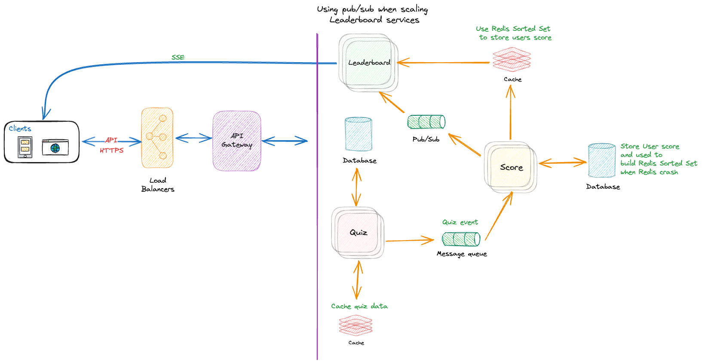
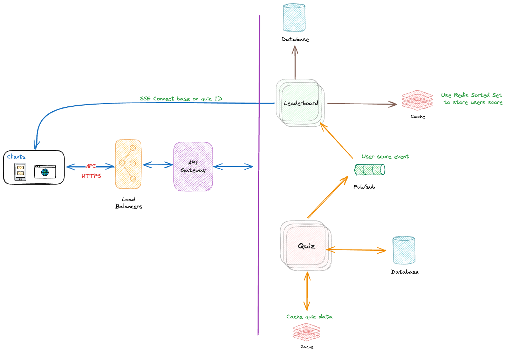
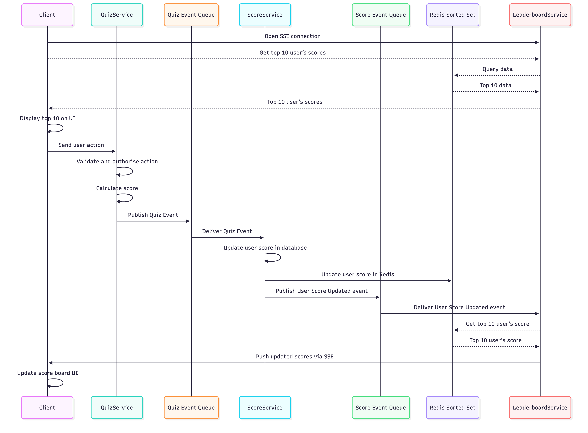
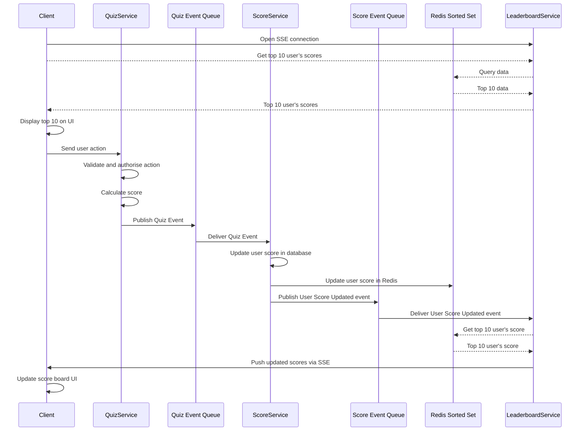

# **Real-Time Score & Leaderboard System - System Design**

# Introduction

This document outlines the architecture design for a scalable, Real-Time Score & Leaderboard System. The platform is designed to support large-scale user interactions while ensuring seamless performance and reliability.

The system enables users make an action (example complete a quiz) and track scores, and view leaderboards in real time. By leveraging modern technologies and efficient design principles, the platform will deliver a highly engaging user experience.

Key features of the system include:
- Real-time leaderboard updates based on user scores.
- Robust and scalable architecture to handle a large number of concurrent users.
- Modular design to facilitate future enhancements and maintenance.

This document includes the high-level architecture, detailed components, data flow diagrams, and the technology stack used to build the system.

# **High-Level Architecture**
## Overview

This document outlines the backend specifications for the Score and Leaderboard modules. The system is designed to handle user actions (assumed to be answering quiz questions), update scores securely, and broadcast the top 10 rankings to connected clients in real-time.

The architecture is designed to:
- Support large-scale, real-time user interactions.
- Use a **message queue** to ensure reliable and asynchronous communication between services.
- Leverage **caching mechanisms** for improved performance and reduced latency.

`Note`: While the original requirement refers generally to `user actions` that `increase score`, for the purposes of this architecture we `assume` these actions involve `answering quiz questions`. Therefore, a `Quiz service` is included in the following diagram.

## Diagram

The following diagram illustrates the high-level architecture of the Real-Time Score & Leaderboard system:



<details>
  <summary>Alternative Architecture</summary>

  ### Alternative
  In the above diagram, we separated the system into three services: `Leaderboard`, `Quiz`, and `Score`. However, we also considered an alternative approach that only uses two services: `Leaderboard` and `Quiz`. In this design, the Score service is merged into the `Leaderboard` service.
  
  This approache has some pros and cons:
  #### Pros:
  - `Simplicity`: Fewer services reduce deployment and management overhead.
  - `Lower Latency`: Eliminates inter-service communication between Score and Leaderboard.
  #### Cons:
  - `Tightly Coupled Responsibilities`: Leaderboard becomes overloaded with multiple responsibilities (score storage, processing, and ranking).
  - `Scalability Challenges`: The merged Leaderboard service may face performance bottlenecks under high load.
  - `Higher Risk of Failure`: A failure in the Leaderboard service would impact both scoring and ranking functionalities.
  - `Reduced Flexibility`: Future enhancements to scoring logic or leaderboard features would require changes in the same service, increasing the risk of introducing bugs.

  Base on above **Pros** and **Cons** We Chose a Separate Score and Leaderboard Service design because it provides better scalability, fault isolation, and modularity.

</details>

# Components
### Client
The client refers to the frontend application, which could be a mobile app or a web app. It interacts with the backend system via the API Gateway. The client is responsible capturing user actions, and displaying leaderboard data.

### Load Balancer
The load balancer ensures high availability and scalability by distributing incoming requests across multiple instances of the API Gateway. It handles HTTPS termination and provides fault tolerance.

### API Gateway
The API Gateway acts as a single entry point for all client requests. It routes requests to the appropriate microservices (Quiz, Leaderboard, or Score) based on the endpoint. It also handles security features such as authentication, rate limiting, and logging.

### Leaderboard Service
The Leaderboard service is responsible for maintaining and serving real-time leaderboard data. It uses a Redis Sorted Set to store and retrieve user scores efficiently. It processes Score Updated events from the message queue to update the leaderboard rankings.

### Quiz Service
The Quiz service is the entry point for user actions that affect scores. It validates and authorises each action, calculate score, and sends a **Quiz Event** to the message queue for the Score service to process.

### Score Service
The Score service tracks user scores. It stores scores in its database and generates events for score updates, which are sent to the message queue. This ensures other services, like Leaderboard, stay synchronized.

### Cache Quiz Data
To reduce latency and improve scalability, quiz data is cached in a distributed cache. Frequently accessed quizzes and their metadata are stored here, reducing the load on the Quiz Database.

### Redis Cache for Sorted Set to Store User Scores
Redis is used as a high-performance, in-memory data store for leaderboard rankings. The Sorted Set data structure in Redis allows efficient ranking, retrieval, and updates of user scores.

### Message Queue: Quiz Event
This message queue is used to decouple the Quiz and Score services. When a user completes a quiz, the Quiz service publishes a Quiz Event. The Score service consumes this event, processes the score, and updates its database.

### Pub/sub: Communicate between Score and Leaderboard
The Pub/Sub component ensures all Leaderboard service instances receive Score Updated events from the Score service. This is necessary because clients can establish SSE connections to different Leaderboard instances. If only one instance received the event, clients connected to other instances would miss real-time updates. The Pub/Sub component distributes events to all instances, ensuring consistent and scalable real-time notifications.

### Database for Quiz
The Quiz Database stores quiz-related data such as questions, answers..

### Database for Score Services
The Score Database stores user scores, which can be used to rebuild the leaderboard in case of a Redis crash.

# Data Flow


## Main data flow
The main data flow describes the complete process. This ensures that the client's UI displays real-time updates as users submit actions and scores are updated.


<details>
  <summary>Data Flow</summary>


</details>


### Key Flow Description

1. **Client opens real-time connection**
   - The **Client** opens an SSE connection to the **LeaderboardService**.
   - The **LeaderboardService** uses this connection to push score changes to the client in real time.

2. **User performs an action**
   - The **Client** sends a request to the **QuizService** when a user completes a quiz that can change their score.
   - The **QuizService** validates and authorises the action.
   - If the action is valid, the **QuizService** publishes a **Quiz Event** to the **Quiz Event Queue**.

3. **Score is updated**
   - The **ScoreService** consumes the **Quiz Event** from the **Quiz Event Queue**.
   - The **ScoreService** updates the user’s score in the **Score Database**.
   - The **ScoreService** also updates the user’s score in the **Redis Sorted Set**.
   - The **ScoreService** publishes a **User Score Updated** event to the **Score Event Queue**.

4. **Leaderboard pushes new scores**
   - The **LeaderboardService** consumes the **User Score Updated** event from the **Score Event Queue**.
   - The **LeaderboardService** reads the latest scores (for example, the top 10 users) from the **Redis Sorted Set**.
   - The **LeaderboardService** sends the updated scores to the **Client** over the existing SSE connection.
   - The **Client** updates the scoreboard UI to display the new scores.

### Real-Time Updates

The real-time updates in the system are managed through a combination of **Server-Sent Events (SSE)** and efficient data storage mechanisms.

1. **Server-Sent Events (SSE)**:
   - A persistent connection is established between the **LeaderboardService** and the **Client**.
   - Real-time events, such as a user’s score being updated, are pushed to the **Client**.

2. **Redis Sorted Set**:
   - Acts as a real-time cache to store user scores with efficient ranking capabilities.
   - Scores are quickly updated in the **Redis Sorted Set** whenever the **ScoreService** processes a new event.

3. **Database**:
   - Stores historical quiz data and user scores.
   - Serves as a backup to rebuild the **Redis Sorted Set** in case of failure.

This flow ensures that:
- **Clients** receive immediate updates when events occur (e.g., user complete a quiz).
- The leaderboard remains up-to-date and reflects real-time scores.
- **Redis Sorted Set** enables fast score retrieval, while the **Database** guarantees data persistence.

# Authentication & Security
To ensure integrity, We must implement a Server-Side Validation and Token-Based Authentication strategy.

## Implementation Details
### JWT Authentication:

All requests to the Score Service must include a valid JSON Web Token (JWT) in the Authorization header.
The API Gateway validates the JWT signature before forwarding the request to the backend.
Using short-live for `jwt` token and using long-live `refresh-token` to get new `jwt` token.

### Action Verification (Anti-Tampering):

`Server-Side Calculation` : Client sends only what happened (e.g., “finished a quiz”, “answered 8/10 correctly”), not the numeric score.
Backend calculates the score using its own rules

`Rate Limiting`: Implement rate limiting at the API Gateway to prevent script-kiddies from flooding the submit endpoint.

`Idempotency`:
Each action from the client includes a unique actionId (UUID) and a timestamp.
The backend stores processed actionIds per user and ignores duplicates.
This stops users from re-sending the same “success” request to increase their score many times.

`Audit Logging and Anomaly Detection`:
Log all score changes with: user id, old score, new score, action type, IP, user agent, and timestamp.
- Periodically run checks or simple rules:
- Sudden huge score jumps
- Too many successful actions in a short time
- Flag suspicious users for manual review or automatic temporary block.

# Technologies and Tools
This section outlines the technical decisions and tools used to design the Realtime Score & Leaderboard System. The architecture prioritizes scalability, performance, and real-time communication to deliver a seamless user experience.

## Microservices Architecture

We have chosen a **Microservices Architecture** to design the **Real-Time Score & Leaderboard System**. This approach provides the following key benefits:

- **Scalability**: Each service (e.g., Quiz, Score, Leaderboard) can scale independently based on workload, ensuring efficient resource utilization.
- **Maintainability**: Services are decoupled, allowing teams to develop, test, and deploy components independently without affecting the entire system.
- **Flexibility**: Different technologies can be used for different services, optimizing performance for specific tasks (e.g., Redis for caching scores).
- **Fault Isolation**: Failures in one service do not impact the availability of others, improving overall system resilience.
- **Deployment Efficiency**: Independent deployment enables faster updates and reduces downtime.

By adopting Microservices, we ensure a scalable, maintainable, and resilient architecture for the **Realtime Score & Leaderboard System**.


## API Selection: GraphQL

We have selected **GraphQL** as the API technology for the **Real-Time Score & Leaderboard System**, instead of REST or gRPC. The following reasons justify this choice:

- **Flexible Data Fetching**: Clients can request exactly the data they need, reducing over-fetching and under-fetching common in REST APIs.
- **Efficient Communication**: A single GraphQL query can retrieve data from multiple services (e.g., Quiz, Score, Leaderboard) in one request, improving performance and reducing network latency.
- **Schema-Driven Development**: GraphQL enforces a strongly-typed schema, making it easier to understand, document, and evolve the API.
- **Client-Centric**: GraphQL provides a consistent and predictable API structure, which enhances the developer experience for frontend teams.
- **Versioning & Documentation**: GraphQL enables continuous API evolution without rigid versioning by allowing seamless field additions and deprecations. Its schema introspection ensures documentation is automatically generated and always in sync with the implementation.

By using **GraphQL**, we ensure efficient, flexible, and streamlined data communication between clients and the backend services in the **Real-Time Score & Leaderboard System**.

## Realtime Communication: Server-Sent Events (SSE)

For real-time communication between the client and backend, we have chosen **Server-Sent Events (SSE)** instead of WebSockets.

<details>
  <summary>Justification for SSE</summary>

### Justification for SSE
- **Read-Heavy Workload**: In this system, the client primarily listens for real-time updates (e.g., leaderboard scores) from the backend. SSE is well-suited for heavy read operations with minimal write requirements.
- **Simplicity**: SSE is lightweight, easy to implement, and works seamlessly over standard HTTP/HTTPS connections, unlike WebSockets, which require a persistent bidirectional connection.
- **API for Writes**: Since write operations are low in volume, they are handled efficiently through the API instead of real-time communication.

### Limitations of SSE
While SSE is a great fit for our use case, we acknowledge its limitations compared to WebSockets:
- **Unidirectional Communication**: SSE supports only server-to-client communication. For bidirectional communication, WebSockets would be required.
- **Connection Limits**: Browsers may limit the number of simultaneous SSE connections per domain.
- **Text-Only Data**: SSE can only send text-based data (UTF-8 encoded). Binary data transmission is not supported, unlike WebSockets.

Despite these limitations, **SSE** is ideal for our system's real-time requirements due to its simplicity and focus on server-to-client data streaming.

</details>

## Database: Redis

We have chosen Redis as the database solution for the Real-Time Score & Leaderboard System, leveraging its in-memory data structure store capabilities and Sorted Set feature.

<details>
  <summary>Justification for Redis</summary>

### Justification for Redis
- **In-Memory Performance**: Redis operates primarily in memory, offering extremely low latency for read and write operations, which is essential for real-time score updates and leaderboard generation.
- **Sorted Sets for Leaderboards**: Redis provides native support for Sorted Sets, which makes it highly efficient for ranking user scores and retrieving leaderboard data based on score ranges or rankings.
- **Scalability**: Redis supports horizontal scaling through clustering, ensuring the system can handle a growing number of users and increasing real-time data demands.
- **Atomic Operations**: Redis ensures atomicity for operations like incrementing scores and updating leaderboards, reducing the risk of data inconsistencies in high-concurrency environments.
- **Ease of Integration**: Redis has robust support for various programming languages and frameworks, ensuring seamless integration with the NestJS application backend.

By choosing Redis, we ensure high-performance, low-latency, and scalability, along with features specifically suited to real-time systems like the Real-Time Score & Leaderboard System.

</details>

## Database: NoSQL

We have chosen a **NoSQL database** for the **Real-Time Score & Leaderboard System** instead of a traditional SQL database.

<details>
  <summary>Justification for NoSQL</summary>

### Justification for NoSQL
- **Flexible Schema**: NoSQL allows dynamic and flexible data structures, which are ideal for storing varied and evolving quiz data, scores, and leaderboard entries.
- **High Scalability**: NoSQL databases are designed for horizontal scaling, making them capable of handling large volumes of data and traffic efficiently.
- **Performance**: NoSQL provides fast read and write operations, which is critical for real-time updates to the leaderboard and scores.
- **Optimized for JSON**: Data in the system (e.g., quiz results and user scores) can be stored in JSON-like formats, enabling seamless integration with APIs and modern backend services.

By choosing **NoSQL** solutions like `MongoDB`, we ensure scalability, flexibility, and high performance, making them an ideal fit for the demands of the **Real-Time Score & Leaderboard System**.

</details>

## Message Queue (Kafka)

For communication between services, we have chosen to use a **message queue** instead of direct API calls (REST/GraphQL/gRPC). Specifically, we have selected **Kafka** as our message queue solution.


<details>
  <summary>Justification for Message Queue</summary>

### Justification for Message Queue
- **Asynchronous Communication**: Message queues enable asynchronous communication between services, which helps decouple components and allows them to operate independently without direct, real-time dependency on each other.
- **Scalability**: Kafka can handle high-throughput and large-scale data streaming, making it well-suited for systems with high volumes of events and real-time processing, such as our quiz system.
- **Reliability**: Kafka guarantees message delivery and ensures that no data is lost in case of service failures, improving the system's reliability.
- **Event-Driven Architecture**: By using a message queue, we enable an event-driven architecture, where services respond to events like score updates or quiz submissions, rather than relying on traditional API calls.

### Why Kafka over SQS or RabbitMQ?
- **High Throughput**: Kafka is optimized for high-throughput messaging, making it ideal for scenarios like the real-time score updates in our system, where millions of events may need to be processed quickly.
- **Durability and Fault Tolerance**: Kafka ensures message durability and supports replication, which provides greater fault tolerance compared to SQS or RabbitMQ.
- **Distributed Nature**: Kafka is designed for distributed environments, providing better scalability and performance across multiple nodes compared to other message queue systems.

By choosing **Kafka** as the message queue, we ensure robust, scalable, and reliable communication between services in the **Real-Time Score & Leaderboard System**.

</details>

## Pub/Sub Component

To enable real-time communication between the Score and Leaderboard services, two potential solutions for the pub/sub component have been evaluated based on the system's requirements and assumptions.

| Criteria | Redis Pub/Sub | Kafka | Winner |
| :--- | :--- | :--- | :--- |
| **Latency** | 1-5ms | 50-100ms | 🏆 Redis |
| **Message Durability** | ❌ No persistence | ✅ Persistent (configurable) | 🏆 Kafka |
| **Message Replay** | ❌ Not supported | ✅ Can replay from offset | 🏆 Kafka |
| **Scalability** | Good (100K+ msg/sec per instance) | Excellent (millions msg/sec) | 🏆 Kafka |
| **Operational Complexity** | ⭐ Simple | ⭐⭐⭐⭐ Complex | 🏆 Redis |
| **Guaranteed Delivery** | ❌ Fire-and-forget | ✅ At-least-once / Exactly-once | 🏆 Kafka |
| **Fan-out to Multiple Consumers** | ✅ Native (all subscribers get msg) | ✅✅ Excellent (consumer groups) | 🏆 Kafka |
| **Memory Footprint** | Low | High (stores messages) | 🏆 Redis |
| **Cost** | $ Lower | $$$ Higher | 🏆 Redis |

We choose `Redis Pub/Sub` for broadcasting score updates because it delivers the lowest possible latency (sub-millisecond) with almost zero overhead.
Unlike Kafka, we don’t need message durability or replay, since the latest leaderboard state is always available in Redis Sorted Sets.
Redis Pub/Sub is extremely simple, reliable at our scale, and lets every Leaderboard instance receive updates instantly so clients see real-time changes without delay.

## Backend Framework: Node.js / NestJS

For the backend of the **Real-Time Score & Leaderboard System**, we have selected **Node.js** with **NestJS** as the framework.


<details>
  <summary>Justification for Node.js and NestJS</summary>

  - **Node.js**:
    - **High Performance**: Node.js is built on the V8 JavaScript engine, which allows for non-blocking, asynchronous I/O operations, making it ideal for handling numerous concurrent connections, such as real-time quiz updates.
    - **Scalability**: Its event-driven architecture allows for easy scaling, which is essential for a real-time system that needs to handle many users at once.
    - **Large Ecosystem**: With Node.js, we can leverage a vast ecosystem of packages and libraries, speeding up development and ensuring robust, well-supported features.

  - **NestJS**:
    - **Modular Structure**: NestJS provides a modular architecture, which aligns well with the microservices approach. It allows us to build services with clear separation of concerns, improving maintainability.
    - **TypeScript Support**: NestJS is built with TypeScript, providing type safety, enhanced developer tooling, and better code quality, making it easier to maintain and scale the system.
    - **Built-in Features**: NestJS comes with built-in support for things like dependency injection, middleware, and routing, reducing the need for boilerplate code and allowing developers to focus on business logic.
    - **Microservices Compatibility**: NestJS natively supports microservices, making it an ideal choice for our distributed architecture, where services need to communicate efficiently.

</details>


## Monitoring and Logging

### Log Levels
- **ERROR**: Critical failures
- **WARN**: Failed attempts, suspicious activity
- **INFO**: Normal operations
- **DEBUG**: Detailed debugging (dev only)

> **Note**: Remove sensitive data (passwords, tokens) from logs.

### Key Metrics

#### Performance
- API response time (P95, P99)
- Requests per second
- Error rate

#### System Health
- CPU and memory usage
- Database connections
- Active SSE connections

#### Security
- Failed authentication count
- Rate limit violations
- Unusual score patterns

### Tools
- **Logs**: ELK Stack, Signoz
- **Metrics**: Prometheus + Grafana, Datadog, Signoz
- **Alerts**: PagerDuty, Slack


# API Specifications

## Overview
This section defines the API specifications for the Real-Time Score & Leaderboard System. The system uses **GraphQL** for client-server interactions, **Server-Sent Events (SSE)** for real-time leaderboard updates, **Kafka message queue** and **Redis Pub/Sub** for asynchronous inter-service communication.

## Authentication
All API requests (except public endpoints if any) require a valid JSON Web Token (JWT).
- **Header**: `Authorization: Bearer <token>`
- **Token Payload**: Should contain `userId`, `username`, and `roles`.

## GraphQL API
The system exposes a GraphQL API for user actions and data retrieval.

### Queries

#### `getLeaderboard`
Fetches the current top 10 users on the leaderboard.
- **Input**: None
- **Output**: `[LeaderboardEntry]`
  - `userId`: ID of the user.
  - `username`: Display name.
  - `score`: Current score.
  - `rank`: Position in the leaderboard.

### Mutations

#### `submitQuizAction(input: QuizActionInput!)`
Submits a user's action (e.g., answering a question) for validation and scoring.
- **Input**: `QuizActionInput`
  - `quizId`: ID of the quiz.
  - `actionId`: Unique UUID for idempotency.
  - `answers`: List of answers (e.g., `[{ questionId: "q1", selectedOption: "a" }]`).
  - `timestamp`: Client timestamp.
- **Output**: `QuizSubmissionResult`
  - `success`: Boolean indicating if the submission was accepted.
  - `message`: Status message.

### Data Loader
To optimize performance and solve the N+1 problem in GraphQL, we use **DataLoader**.
- **Purpose**: Batching and caching database requests.
- **Usage**: When fetching nested resources (e.g., user details for leaderboard entries), DataLoader batches multiple requests into a single database query.

## Real-Time API (SSE)
Server-Sent Events are used to push leaderboard updates to connected clients.

### Connection
- **Endpoint**: `GET /api/v1/leaderboard/stream`
- **Headers**:
  - `Accept: text/event-stream`
  - `Authorization: Bearer <token>` (Connection requires auth)
- **Behavior**:
  - The server keeps the connection open.
  - Clients automatically reconnect on disconnect (handled by browser `EventSource`).

### Events

#### `leaderboard_update`
Sent when the top 10 leaderboard changes.
- **Event Name**: `update`
- **Data Format**: JSON
```json
{
  "timestamp": "2023-10-27T10:00:00Z",
  "leaderboard": [
    { "rank": 1, "username": "Alice", "score": 1500 },
    { "rank": 2, "username": "Bob", "score": 1450 },
    ...
  ]
}
```

## Message Queue & Pub/Sub (Internal)
Redis Pub/Sub is used for decoupling services and ensuring reliable data processing.

### Topics

#### `quiz.events`
Events related to quiz actions (e.g., completion).
- **Producer**: Quiz Service
- **Consumer**: Score Service

#### `score.events`
Events related to user score updates.
- **Producer**: Score Service
- **Consumer**: Leaderboard Service (all instances)

### Message Schemas

#### `QuizCompletedEvent` (Topic: `quiz.events`)
```json
{
  "eventId": "uuid",
  "eventType": "QUIZ_COMPLETED",
  "payload": {
    "userId": "user123",
    "quizId": "quiz456",
    "scoreDelta": 10,
    "timestamp": "2023-10-27T10:00:00Z"
  }
}
```

#### `ScoreUpdatedEvent` (Topic: `score.events`)
```json
{
  "eventId": "uuid",
  "eventType": "SCORE_UPDATED",
  "payload": {
    "userId": "user123",
    "newTotalScore": 1550,
    "timestamp": "2023-10-27T10:00:05Z"
  }
}
```


# Testing Strategy

## Unit Tests
### Purpose
Test individual functions and components in isolation.

### What to Test
- Business logic
- Input validation
- Authentication/authorization
- Data calculations
- Error handling

### Tools
- `Jest, Mocha`

### Target
- Code coverage >80%

## Integration & End-to-End Tests
### Purpose
Test components working together and complete user workflows.

### What to Test
- GraphQL queries and mutations
- Database operations
- SSE real-time updates
- Authentication flows
- Complete business workflows
- Data consistency across system

### Tools
- `API Testing`: Supertest, Postman
- `E2E Testing`: Cypress, Playwright, Selenium

## Load Testing Plan
### Purpose
Verify system performance under various traffic conditions.

### Test Types
- **Baseline**: Normal traffic (30 min)
- **Peak Load**: Maximum expected traffic (15 min)
- **Stress**: Beyond capacity to find limits (1 hour)
- **Spike**: Sudden traffic increase (10 min)
- **Endurance**: Sustained load (4-8 hours)

### What to Monitor
- Response times
- Throughput
- Error rates
- CPU/Memory usage
- Database performance

### Tools
- k6 (recommended)
- JMeter
- Artillery

# Risks & Mitigations

## Scalability
- **Risk**: Sudden spikes in traffic (e.g., during a popular event) causing system slowdowns or crashes.
- **Mitigation**:
  - Auto-scaling groups for API Gateway and Microservices.
  - Redis Cluster for distributed caching and leaderboard management.
  - Rate limiting at the API Gateway level.

## Security (Cheating)
- **Risk**: Users automating requests to artificially inflate scores.
- **Mitigation**:
  - Implement strict rate limiting and throttling.
  - Use signed requests or tokens (JWT) to verify the authenticity of score submissions.
  - Analyze user behavior patterns for anomalies (e.g., impossible completion times).

## Availability
- **Risk**: Single point of failure in critical components (e.g., Redis, Message Queue).
- **Mitigation**:
  - Use managed services with high availability (e.g., AWS ElastiCache).
  - Implement circuit breakers and fallback mechanisms (e.g., serve cached leaderboard if live updates fail).


# Additional Comments for Improvement

## In memory cache for LeaderBoard service
- **Issue**: Currently, the system queries Redis on every score update. If 1000 users update scores/second, the system queries Redis 1000 times/second.
- **Improvement**: Cache the top 10 in memory within the **LeaderboardService**. We only query from Redis if a new score affects the top 10.


## Handling the "Thundering Herd" on Leaderboard
- **Issue**: If the user base is massive, broadcasting the entire Top 10 list to all connected clients every time one user scores points is inefficient and expensive.
- **Improvement**: Implement **Throttling/Debouncing** in the Leaderboard Service. Only broadcast updates every $X$ seconds (e.g., every 1 second) rather than on every single event.

## Connection Limits (SSE)
- **Issue**: Browser limits for SSE (6 connections per domain) can be an issue for users with multiple tabs.
- **Improvement**: Use **HTTP/2**, which allows multiplexing, or implement a **Shared Worker** on the frontend to maintain a single connection per browser instance.

## Segmented Leaderboards
To increase user engagement and provide fairer competition, we should support segmented leaderboards based on timeframes and user location.

### Time-Based (Weekly/Monthly)
Instead of a single Redis key (leaderboard), we implement a **Key Namespacing Strategy**.
- **Global**: `leaderboard:all`
- **Weekly**: `leaderboard:weekly:<year>-<week_number>` (e.g., `leaderboard:weekly:2023-47`)
- **Monthly**: `leaderboard:monthly:<year>-<month>` (e.g., `leaderboard:monthly:2023-11`)

### Location-Based
We can partition users by country or region stored in their user profile.
- **Country**: `leaderboard:country:<country_code>` (e.g., `leaderboard:country:VN`)
